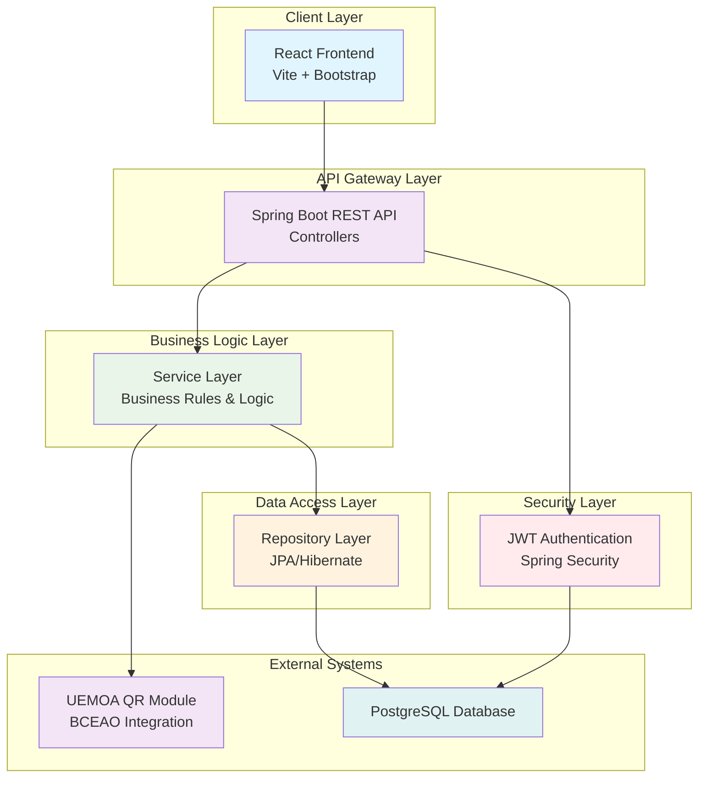
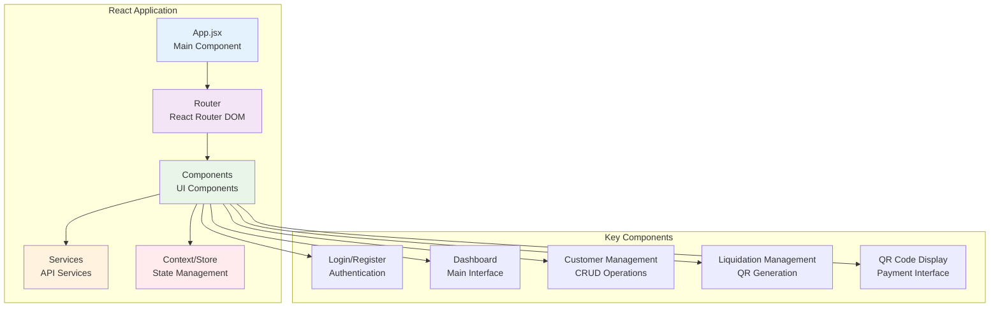
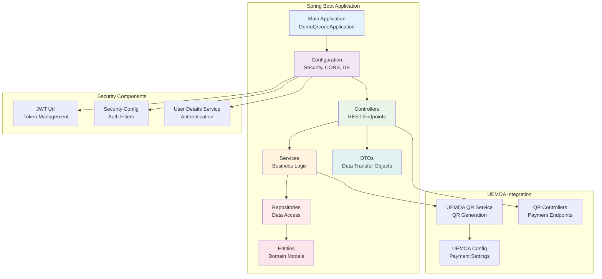
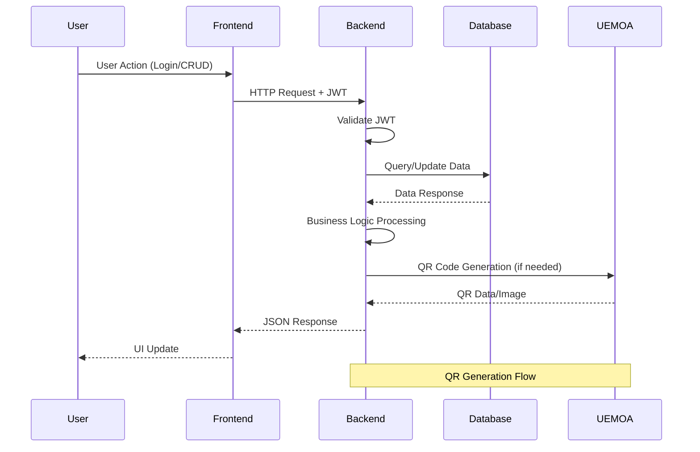
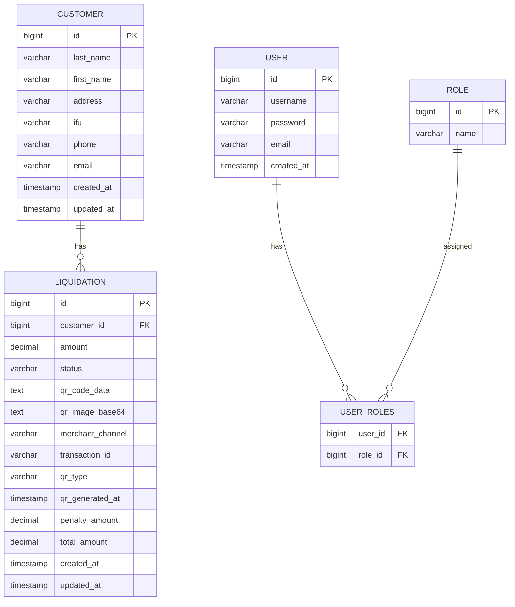
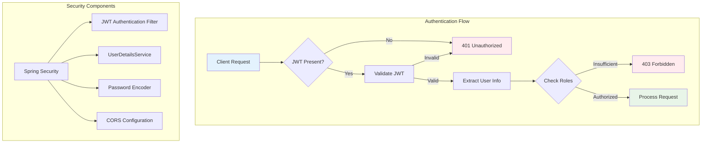
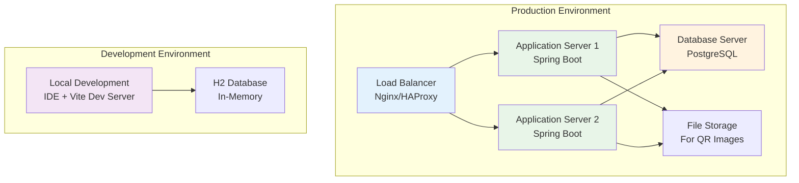

# System Architecture

## High-Level Architecture

The Liquidation App follows a modern layered architecture pattern with clear separation of concerns, ensuring maintainability, scalability, and testability.

## Component Architecture

### Frontend Architecture

### Backend Architecture

## Data Flow Architecture

## Database Schema

## Security Architecture

## Deployment Architecture

## Technology Stack Details

### Backend Technologies
- **Framework**: Spring Boot 3.4.8
- **Language**: Java 17
- **Security**: Spring Security + JWT
- **Database**: PostgreSQL (Production), H2 (Testing)
- **Build Tool**: Maven
- **ORM**: Hibernate/JPA
- **Validation**: Bean Validation
- **Documentation**: SpringDoc OpenAPI

### Frontend Technologies
- **Framework**: React 19.1.1
- **Build Tool**: Vite
- **Styling**: Bootstrap 5.3.7
- **Routing**: React Router DOM 7.8.0
- **HTTP Client**: Axios 1.11.0
- **Forms**: React Hook Form 7.62.0
- **Validation**: Yup 1.7.0
- **Notifications**: React Toastify 11.0.5
- **QR Generation**: QRCode.react 4.2.0

### External Integrations
- **UEMOA QR Module**: Custom implementation for BCEAO compliance
- **Payment System**: BCEAO Payment Interface integration
- **Database**: PostgreSQL with Flyway migrations

## Design Patterns Used

1. **Layered Architecture**: Clear separation between presentation, business, and data layers
2. **Repository Pattern**: Abstract data access layer
3. **Service Layer Pattern**: Business logic encapsulation
4. **DTO Pattern**: Data transfer object for API communication
5. **Factory Pattern**: QR code generation based on type
6. **Strategy Pattern**: Different authentication strategies
7. **Observer Pattern**: Event-driven architecture for notifications

## Performance Considerations

- **Database Indexing**: Optimized queries with proper indexing
- **Connection Pooling**: HikariCP for efficient database connections
- **Caching**: Application-level caching for frequently accessed data
- **Lazy Loading**: JPA lazy loading for related entities
- **Pagination**: Server-side pagination for large datasets
- **Async Processing**: Asynchronous QR code generation
- **CDN**: Static asset delivery optimization

## Scalability Features

- **Horizontal Scaling**: Stateless application design
- **Database Sharding**: Potential for future database scaling
- **Microservices Ready**: Modular architecture for service decomposition
- **API Gateway**: Centralized API management
- **Load Balancing**: Distributed request handling
- **Caching Layer**: Redis integration ready
- **Message Queue**: Asynchronous processing capabilities