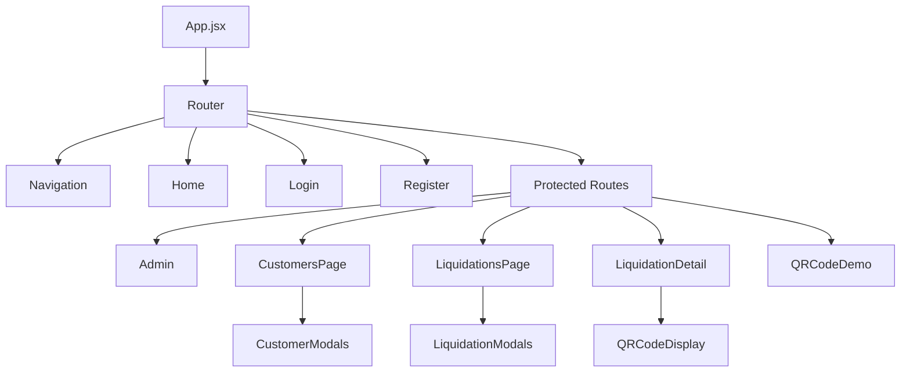

# Frontend Documentation

## Overview

The frontend is a modern React application built with Vite, providing a responsive web interface for managing customers, liquidations, and QR code generation. It features a clean Bootstrap-based UI with comprehensive form validation and user-friendly interactions.

## Technology Stack

- **React 19.1.1**: Modern JavaScript library with Hooks
- **Vite**: Fast build tool and development server
- **Bootstrap 5.3.7**: Responsive CSS framework
- **React Router DOM 7.8.0**: Client-side routing
- **Axios 1.11.0**: HTTP client for API communication
- **React Hook Form 7.62.0**: Performant form management
- **Yup 1.7.0**: Schema-based form validation
- **React Toastify 11.0.5**: Notification system
- **QRCode.react 4.2.0**: QR code generation and display
- **React Data Table Component 7.7.0**: Advanced table functionality

## Project Structure

```
frontend-liquidation-app/
├── src/
│   ├── components/
│   │   ├── customers/
│   │   │   ├── CustomerModals.jsx      # Customer CRUD modal forms
│   │   │   └── CustomersPage.jsx       # Customer management page
│   │   ├── liquidations/
│   │   │   ├── LiquidationDetail.jsx   # Liquidation detail view
│   │   │   ├── LiquidationModals.jsx   # Liquidation CRUD modals
│   │   │   ├── LiquidationsPage.jsx    # Liquidation management page
│   │   │   └── QRCodeDisplay.jsx       # QR code display component
│   │   ├── Admin.jsx                   # Admin dashboard
│   │   ├── Home.jsx                    # Landing page
│   │   ├── Login.jsx                   # Authentication form
│   │   ├── Navbar.jsx                  # Navigation component
│   │   ├── ProductList.jsx             # Legacy product management
│   │   ├── ProtectedRoute.jsx          # Route protection wrapper
│   │   ├── QRCodeDemo.jsx              # QR code demonstration
│   │   └── Register.jsx                # User registration form
│   ├── services/
│   │   ├── api.js                      # Axios configuration and auth service
│   │   ├── customerService.js          # Customer API operations
│   │   └── liquidationService.js       # Liquidation API operations
│   ├── config.js                       # Application configuration
│   ├── App.jsx                         # Main application component
│   ├── main.jsx                        # Application entry point
│   ├── App.css                         # Component styles
│   └── index.css                       # Global styles
├── public/
│   └── vite.svg                        # Vite logo asset
├── package.json                        # Dependencies and scripts
├── vite.config.js                      # Vite configuration
├── eslint.config.js                    # ESLint configuration
└── index.html                          # HTML template
```

## Application Architecture

### Component Hierarchy



### State Management

The application uses a combination of:
- **Local Storage**: For authentication tokens and user data persistence
- **React Hooks**: useState and useEffect for component-level state
- **Context API**: Potential for global state management (not currently implemented)

## Key Components

### Core Components

#### App.jsx
Main application component handling routing and global layout.

**Features:**
- React Router setup with protected routes
- Bootstrap CSS integration
- Toast notifications configuration
- Global error boundaries

#### ProtectedRoute.jsx
Route guard component ensuring authentication and authorization.

```jsx
const ProtectedRoute = ({ children, requireAdmin = false }) => {
  const isAuthenticated = authService.isAuthenticated();
  const isAdmin = authService.isAdmin();

  if (!isAuthenticated) {
    return <Navigate to="/login" replace />;
  }

  if (requireAdmin && !isAdmin) {
    return <Navigate to="/" replace />;
  }

  return children;
};
```

### Authentication Components

#### Login.jsx
User authentication form with validation.

**Features:**
- Form validation with Yup schema
- Error handling and display
- Remember me functionality
- Redirect after successful login

#### Register.jsx
User registration form for both regular users and administrators.

**Features:**
- Dual registration modes (user/admin)
- Comprehensive form validation
- Password strength requirements
- Email format validation

#### Navbar.jsx
Responsive navigation bar with authentication status.

**Features:**
- Dynamic menu based on user role
- Logout functionality
- Mobile-responsive design
- Active route highlighting

### Customer Management

#### CustomersPage.jsx
Main customer management interface.

**Features:**
- Paginated customer list with search
- Data table with sorting and filtering
- CRUD operations through modal dialogs
- Real-time search functionality
- Bulk operations support

#### CustomerModals.jsx
Modal forms for customer operations.

**Features:**
- Create/Edit customer forms
- Form validation with error display
- Address and contact information fields
- IFU (tax ID) field for UEMOA compliance

### Liquidation Management

#### LiquidationsPage.jsx
Liquidation management dashboard.

**Features:**
- Advanced filtering by customer, status, date range
- Status-based color coding
- Quick actions (pay, view, edit)
- Pagination with configurable page sizes
- Export functionality (planned)

#### LiquidationDetail.jsx
Detailed liquidation view with QR code integration.

**Features:**
- Complete liquidation information display
- QR code generation and display
- Payment status tracking
- Penalty calculation display
- Transaction history

#### LiquidationModals.jsx
Modal forms for liquidation CRUD operations.

**Features:**
- Customer selection dropdown
- Amount and penalty input
- Status management
- Date range validation

#### QRCodeDisplay.jsx
Specialized QR code display and management component.

**Features:**
- QR code rendering with QRCode.react
- Download functionality (PNG format)
- Copy to clipboard
- Print support
- Error correction level configuration

### Administrative Components

#### Admin.jsx
Administrative dashboard for user management.

**Features:**
- User creation and management
- Role assignment
- System statistics
- Audit logging (planned)

### Demonstration Components

#### QRCodeDemo.jsx
QR code functionality demonstration.

**Features:**
- Sample data for testing
- Multiple QR code types
- Real-time generation
- Code inspection tools

#### Home.jsx
Application landing page.

**Features:**
- Welcome message
- Quick navigation links
- System status overview
- Recent activity feed

## Routing Configuration

The application uses React Router DOM for client-side routing:

```jsx
<BrowserRouter>
  <Routes>
    <Route path="/" element={<Home />} />
    <Route path="/login" element={<Login />} />
    <Route path="/register" element={<Register />} />
    <Route 
      path="/admin" 
      element={
        <ProtectedRoute requireAdmin={true}>
          <Admin />
        </ProtectedRoute>
      } 
    />
    <Route 
      path="/customers" 
      element={
        <ProtectedRoute>
          <CustomersPage />
        </ProtectedRoute>
      } 
    />
    <Route 
      path="/liquidations" 
      element={
        <ProtectedRoute>
          <LiquidationsPage />
        </ProtectedRoute>
      } 
    />
    <Route 
      path="/liquidations/:id" 
      element={
        <ProtectedRoute>
          <LiquidationDetail />
        </ProtectedRoute>
      } 
    />
    <Route 
      path="/qr-demo" 
      element={
        <ProtectedRoute>
          <QRCodeDemo />
        </ProtectedRoute>
      } 
    />
    <Route path="*" element={<Navigate to="/" replace />} />
  </Routes>
</BrowserRouter>
```

## API Integration

### Axios Configuration

Centralized HTTP client configuration in `services/api.js`:

```javascript
const api = axios.create({
  baseURL: API_BASE_URL,
  timeout: 10000,
  headers: {
    'Content-Type': 'application/json',
  },
});
```

### Request Interceptors

Automatic JWT token injection for authenticated requests:

```javascript
api.interceptors.request.use(
  (config) => {
    const token = localStorage.getItem(JWT_STORAGE_KEY);
    if (token) {
      config.headers.Authorization = `Bearer ${token}`;
    }
    return config;
  },
  (error) => Promise.reject(error)
);
```

### Response Interceptors

Global error handling with automatic logout on authentication failure:

```javascript
api.interceptors.response.use(
  (response) => response,
  (error) => {
    if (error.response?.status === 401) {
      // Clear authentication data
      localStorage.removeItem(JWT_STORAGE_KEY);
      localStorage.removeItem(USER_STORAGE_KEY);
      // Redirect to login
      window.location.href = '/login';
    }
    return Promise.reject(error);
  }
);
```

## Services Layer

### AuthService

Authentication and user management operations:

```javascript
export const authService = {
  async login(username, password) {
    // JWT token handling
    // User data storage
    // Redirect logic
  },

  async registerUser(username, password) {
    // User registration
  },

  async registerAdmin(username, password) {
    // Admin registration
  },

  logout() {
    // Clear local storage
    // Redirect to login
  },

  isAuthenticated() {
    // Check token existence and validity
  },

  getCurrentUser() {
    // Retrieve user data from storage
  },

  isAdmin() {
    // Check admin role
  }
};
```

### CustomerService

Customer data operations with comprehensive error handling:

```javascript
export const customerService = {
  async list(page = 0, size = 10) {
    // Paginated customer retrieval
  },

  async search(term = '', page = 0, size = 10) {
    // Customer search with filters
  },

  async get(id) {
    // Single customer retrieval
  },

  async create(customerData) {
    // Customer creation
  },

  async update(id, customerData) {
    // Customer update
  },

  async delete(id) {
    // Customer deletion
  }
};
```

### LiquidationService

Liquidation management with advanced filtering:

```javascript
export const liquidationService = {
  async list(filters = {}) {
    // Advanced filtering and pagination
    const { customerId, status, startDate, endDate, page, size } = filters;
    // Build query parameters
  },

  async get(id) {
    // Single liquidation retrieval
  },

  async create(liquidationData) {
    // Liquidation creation
  },

  async update(id, liquidationData) {
    // Liquidation update
  },

  async payLiquidation(id) {
    // Mark as paid
  },

  async getByCustomer(customerId) {
    // Customer-specific liquidations
  },

  async calculatePenalty(id, dailyRate = 0.0) {
    // Penalty calculation
  }
};
```

## Form Management

### React Hook Form Integration

High-performance form handling with validation:

```jsx
const { register, handleSubmit, formState: { errors, isSubmitting } } = useForm({
  resolver: yupResolver(schema),
  defaultValues: initialValues
});
```

### Validation Schemas

Comprehensive validation using Yup:

```javascript
const customerSchema = yup.object({
  lastName: yup.string()
    .required('Le nom est requis')
    .min(2, 'Le nom doit contenir au moins 2 caractères'),
  
  firstName: yup.string()
    .required('Le prénom est requis')
    .min(2, 'Le prénom doit contenir au moins 2 caractères'),
  
  email: yup.string()
    .email('Format d\'email invalide')
    .required('L\'email est requis'),
  
  phone: yup.string()
    .matches(phoneRegex, 'Format de téléphone invalide'),
  
  address: yup.string()
    .max(255, 'L\'adresse ne peut pas dépasser 255 caractères')
});
```

### Error Display

User-friendly error messages with Bootstrap styling:

```jsx
<div className="mb-3">
  <input
    {...register('email')}
    className={`form-control ${errors.email ? 'is-invalid' : ''}`}
    placeholder="Email"
  />
  {errors.email && (
    <div className="invalid-feedback">
      {errors.email.message}
    </div>
  )}
</div>
```

## UI/UX Features

### Bootstrap Integration

Responsive design with Bootstrap 5 components:

- **Grid System**: Flexible layouts for all screen sizes
- **Components**: Modals, forms, buttons, alerts, badges
- **Utilities**: Spacing, colors, typography helpers
- **Responsive Classes**: Mobile-first responsive design

### Data Tables

Advanced table functionality with `react-data-table-component`:

```jsx
const columns = [
  {
    name: 'Nom',
    selector: row => row.lastName,
    sortable: true,
    cell: row => `${row.firstName} ${row.lastName}`
  },
  {
    name: 'Email',
    selector: row => row.email,
    sortable: true
  },
  {
    name: 'Actions',
    cell: row => (
      <div className="d-flex gap-2">
        <button className="btn btn-sm btn-primary">Modifier</button>
        <button className="btn btn-sm btn-danger">Supprimer</button>
      </div>
    )
  }
];
```

### Notifications

Toast notifications for user feedback:

```jsx
import { toast } from 'react-toastify';

// Success notification
toast.success('Client créé avec succès');

// Error notification
toast.error('Erreur lors de la création du client');

// Info notification
toast.info('Chargement en cours...');
```

## Configuration Management

### API Configuration

Centralized configuration in `config.js`:

```javascript
export const API_BASE_URL = 'http://localhost:8080/api';
export const JWT_STORAGE_KEY = 'liquidation_jwt_token';
export const USER_STORAGE_KEY = 'liquidation_user_data';

export const ENDPOINTS = {
  AUTH: {
    LOGIN: '/auth/login',
    REGISTER_USER: '/auth/register/user',
    REGISTER_ADMIN: '/auth/register/admin'
  },
  CUSTOMERS: '/customers',
  LIQUIDATIONS: '/liquidations'
};

export const ROLES = {
  ADMIN: 'ADMIN',
  USER: 'USER'
};

export const LIQUIDATION_STATUS = {
  PENDING: 'PENDING',
  PAID: 'PAID',
  OVERDUE: 'OVERDUE'
};
```

## Security Implementation

### Authentication Flow

1. **Login**: User credentials validation
2. **Token Storage**: JWT token stored in localStorage
3. **Request Headers**: Automatic token injection
4. **Token Validation**: Server-side token verification
5. **Auto Logout**: Automatic logout on token expiration

### Route Protection

Component-level protection for sensitive routes:

```jsx
<ProtectedRoute requireAdmin={true}>
  <AdminDashboard />
</ProtectedRoute>
```

### Data Validation

Client-side validation with server-side verification:

- **Input Sanitization**: XSS prevention
- **Type Validation**: Data type checking
- **Length Validation**: Field length constraints
- **Format Validation**: Email, phone, and custom formats

## Performance Optimizations

### Code Splitting

Vite automatically handles code splitting for optimal bundle sizes.

### Lazy Loading

Components can be lazy loaded for better initial load performance:

```jsx
const LazyCustomerPage = lazy(() => import('./components/customers/CustomersPage'));

// Usage in routes
<Route path="/customers" element={<Suspense fallback={<div>Loading...</div>}><LazyCustomerPage /></Suspense>} />
```

### Memoization

Performance optimization for expensive operations:

```jsx
const columns = useMemo(() => [
  // Column definitions
], [dependencies]);

const filteredData = useMemo(() => {
  return data.filter(item => item.status === filterStatus);
}, [data, filterStatus]);
```

### API Optimization

- **Request Debouncing**: Search input debouncing
- **Pagination**: Server-side pagination for large datasets
- **Caching**: Browser caching for static assets
- **Compression**: Gzip compression for API responses

## Error Handling

### Global Error Boundaries

React error boundaries for graceful error handling:

```jsx
class ErrorBoundary extends React.Component {
  constructor(props) {
    super(props);
    this.state = { hasError: false };
  }

  static getDerivedStateFromError(error) {
    return { hasError: true };
  }

  componentDidCatch(error, errorInfo) {
    // Log error to monitoring service
    console.error('Error caught by boundary:', error, errorInfo);
  }

  render() {
    if (this.state.hasError) {
      return <div className="alert alert-danger">Une erreur s'est produite.</div>;
    }

    return this.props.children;
  }
}
```

### API Error Handling

Consistent error handling across all services:

```javascript
try {
  const response = await api.get(endpoint);
  return response.data;
} catch (error) {
  const message = error.response?.data?.message || 'Une erreur s\'est produite';
  throw new Error(message);
}
```

## Development Tools

### Hot Module Replacement

Vite provides instant HMR for rapid development:

```bash
npm run dev
```

### ESLint Integration

Code quality enforcement with custom rules:

```javascript
// eslint.config.js
export default [
  {
    rules: {
      'react-hooks/rules-of-hooks': 'error',
      'react-hooks/exhaustive-deps': 'warn',
      'react/prop-types': 'off'
    }
  }
];
```

### Build Optimization

Production build with optimization:

```bash
npm run build
```

## Browser Support

- **Chrome**: 90+
- **Firefox**: 88+
- **Safari**: 14+
- **Edge**: 90+
- **Mobile Browsers**: iOS Safari 14+, Chrome Mobile 90+

## Accessibility Features

- **Semantic HTML**: Proper use of semantic elements
- **ARIA Labels**: Screen reader support
- **Keyboard Navigation**: Full keyboard accessibility
- **Focus Management**: Proper focus indicators
- **Color Contrast**: WCAG compliant color schemes
- **Alt Text**: Image descriptions for screen readers

## Testing Strategy

### Unit Testing (Planned)

```javascript
// Example test structure
describe('CustomerService', () => {
  test('should fetch customers with pagination', async () => {
    // Test implementation
  });
});
```

### Integration Testing (Planned)

- API integration tests
- Component integration tests
- E2E testing with Cypress

### Test Utilities

- Jest for unit testing
- React Testing Library for component testing
- MSW for API mocking

## Deployment

### Development Environment

```bash
# Install dependencies
npm install

# Start development server
npm run dev
```

### Production Build

```bash
# Create optimized build
npm run build

# Preview production build
npm run preview
```

### Environment Variables

Support for environment-specific configuration:

```javascript
// .env.local
VITE_API_BASE_URL=http://localhost:8080/api
VITE_APP_NAME=Liquidation App
```

## Future Enhancements

### Planned Features

- **TypeScript Migration**: Type safety and better IDE support
- **Redux Integration**: Complex state management
- **PWA Features**: Offline support and installability
- **Real-time Updates**: WebSocket integration for live data
- **Advanced Analytics**: Dashboard with charts and metrics
- **Multi-language Support**: Internationalization (i18n)
- **Theme Customization**: Dark/light mode support
- **Advanced Search**: Full-text search with filters
- **Export Features**: PDF/Excel export functionality
- **Audit Trail**: Complete user action logging
- **API Documentation**: Integrated API docs with Swagger

### Performance Improvements

- **Service Worker**: Caching and offline functionality
- **Image Optimization**: Lazy loading and WebP support
- **Bundle Analysis**: Webpack bundle analyzer integration
- **CDN Integration**: Static asset delivery optimization

### Security Enhancements

- **CSRF Protection**: Additional CSRF token validation
- **Rate Limiting**: API rate limiting implementation
- **Security Headers**: Comprehensive security headers
- **Vulnerability Scanning**: Automated security testing

This comprehensive frontend documentation provides a complete overview of the React application's architecture, components, and implementation details.